## Hi there 👋

<!--<div align="center">


[](https://git.io/typing-svg)

</div>

<div align="center">

[](https://www.linkedin.com/in/soumyaranjan-pradhan-02b5312ba/)
[](https://soumya2025.pythonanywhere.com/)
[](https://github.com/SoumyarananPradhan)
[](https://www.naukri.com/code360/profile/f4191dd1-ca47-4fef-869b-a102bd7aa9a9)
[](https://drive.google.com/file/d/1RRWHYmE6MUA0hYC9JBzBTAobqBtXb1Mc/view?usp=drive_link)


</div>

---

## 👨‍💻 About Me

I'm an aspiring **Software Developer** and **MCA Student** based in Hyderabad, India, passionate about building scalable web applications and exploring the fascinating world of machine learning. I believe in learning by doing—every project is an opportunity to push boundaries and master new technologies.

```python
class SoumyaranjanPradhan:
    def __init__(self):
        self.role = "Software Developer in Progress"
        self.location = "Hyderabad, India"
        self.education = "Master of Computer Applications (MCA)"
        self.current_focus = ["Web Development", "Django", "Machine Learning"]
        self.learning_philosophy = "Build, Break, Learn, Repeat"
    
    def get_tech_stack(self):
        return {
            "languages": ["Python", "JavaScript", "SQL"],
            "frameworks": ["Django", "Flask"],
            "frontend": ["HTML5", "CSS3", "Bootstrap"],
            "databases": ["PostgreSQL", "MySQL", "SQLite"],
            "tools": ["Git", "VS Code", "Linux"],
            "exploring": ["React.js", "Machine Learning", "Data Science"]
        }
    
    def current_goals(self):
        return [
            "🚀 Build production-ready Django applications",
            "🤖 Master Machine Learning fundamentals",
            "📝 Contribute to open-source projects",
            "🎯 Secure a full-time developer role in 2026"
        ]
```

---

## 🔥 What I'm Building

<table>
  <tr>
    <td align="center" width="50%">
      <h3>🎓 Current Projects</h3>
      <p>📚 <b>Book Review System</b><br/>Django-powered platform for book lovers</p>
      <p>📖 <b>Course Platform</b><br/>E-learning management system</p>
      <p>📱 <b>QR Code Generator & Reader</b><br/>Python-based utility tool</p>
    </td>
    <td align="center" width="50%">
      <h3>🎯 Learning Focus</h3>
      <p>🔧 <b>Django REST Framework</b><br/>Building robust APIs</p>
      <p>⚛️ <b>React.js</b><br/>Modern frontend development</p>
      <p>🤖 <b>Machine Learning</b><br/>Scikit-learn, TensorFlow basics</p>
    </td>
  </tr>
</table>

---

## 💻 Tech Stack & Tools

<div align="center">

### 🚀 Languages & Frameworks


### 🗄️ Databases & Backend


### 🛠️ Tools & Platforms


</div>

---

## 📊 GitHub Analytics

<div align="center">
  
  
</div>

<div align="center">
  
</div>

<div align="center">
  
</div>

---

## 🏆 Featured Projects

<div align="center">

<table>
  <tr>
    <td width="50%" align="center">
      <a href="https://github.com/SoumyarananPradhan/My_Portfolio_Website">
        
      </a>
      <h4>🌐 Portfolio Website</h4>
      <p>My personal portfolio showcasing projects and skills</p>
      <p>
        
        
      </p>
    </td>
    <td width="50%" align="center">
      <a href="https://github.com/SoumyarananPradhan/Book-Review-System">
        
      </a>
      <h4>📚 Book Review System</h4>
      <p>Django-based platform for sharing and discovering book reviews</p>
      <p>
        
        
      </p>
    </td>
  </tr>
  <tr>
    <td width="50%" align="center">
      <a href="https://github.com/SoumyarananPradhan/Course-Platform">
        
      </a>
      <h4>🎓 Course Platform</h4>
      <p>E-learning management system built with Django</p>
      <p>
        
        
      </p>
    </td>
    <td width="50%" align="center">
      <a href="https://github.com/SoumyarananPradhan/QR-Code-Generator-and-Reader">
        
      </a>
      <h4>📱 QR Code Tool</h4>
      <p>Python utility for generating and reading QR codes</p>
      <p>
        
      </p>
    </td>
  </tr>
</table>

</div>

---

## 🎯 My Journey & Milestones

```mermaid
graph LR
    A[🎓 Started MCA] --> B[💻 Learned Python]
    B --> C[🌐 Built First Django App]
    C --> D[📚 Created Portfolio Projects]
    D --> E[🤖 Exploring ML/AI]
    E --> F[🚀 Your Next Big Project?]
    
    style A fill:#3BACE2,stroke:#fff,stroke-width:2px,color:#000
    style B fill:#3BACE2,stroke:#fff,stroke-width:2px,color:#000
    style C fill:#3BACE2,stroke:#fff,stroke-width:2px,color:#000
    style D fill:#3BACE2,stroke:#fff,stroke-width:2px,color:#000
    style E fill:#FF6D00,stroke:#fff,stroke-width:2px,color:#fff
    style F fill:#00C853,stroke:#fff,stroke-width:2px,color:#fff
```



### 📈 Key Achievements

✅ **8+ Repositories** | Built diverse projects showcasing full-stack capabilities  
✅ **Portfolio Deployed** | Live portfolio on PythonAnywhere demonstrating real-world deployment skills  
✅ **Active Learner** | Consistent coding practice on Coding Ninjas platform  
✅ **Problem Solver** | Tackling real-world challenges through hands-on projects  
✅ **Multi-Domain Exposure** | Experience in web dev, automation, and ML fundamentals

---

## 🌱 Current Learning Path

<div align="center">

| 🎯 Focus Area | 📚 Resources | 🏆 Status |
|:-------------:|:------------:|:---------:|
| Django REST Framework | Official Docs + Projects | 🔄 In Progress |
| React.js Fundamentals | Online Courses | 🔄 In Progress |
| Machine Learning Basics | Scikit-learn, Kaggle | 🔄 In Progress |
| Data Structures & Algorithms | Coding Ninjas, LeetCode | ⚡ Active |
| System Design | YouTube, Blogs | 📖 Planning |

</div>

---

## 🤝 Let's Connect & Collaborate

<div align="center">

I'm always excited to connect with fellow developers, learners, and tech enthusiasts! Whether you want to:

🚀 **Collaborate on open-source projects**  
💡 **Discuss web development or machine learning**  
🎓 **Share learning resources and experiences**  
💼 **Explore internship or job opportunities**

**Feel free to reach out!**

[](https://www.linkedin.com/in/soumyaranjan-pradhan-02b5312ba/)
[](https://soumya2025.pythonanywhere.com/)
[](mailto:your-email@example.com)

</div>

---

## 💭 Random Dev Quote

<div align="center">


</div>

---

<div align="center">

### 🔗 Open to Opportunities

**Internships** • **Freelance Projects** • **Open Source Collaboration** • **Full-Time Roles**

💼 Currently seeking **Software Developer** positions where I can contribute, learn, and grow

---


**⭐️ From [SoumyarananPradhan](https://github.com/SoumyarananPradhan) | Built with 💙 and Python**


</div>
**SoumyarananPradhan/SoumyarananPradhan** is a ✨ _special_ ✨ repository because its `README.md` (this file) appears on your GitHub profile.

Here are some ideas to get you started:

- 🔭 I’m currently working on ...
- 🌱 I’m currently learning ...
- 👯 I’m looking to collaborate on ...
- 🤔 I’m looking for help with ...
- 💬 Ask me about ...
- 📫 How to reach me: ...
- 😄 Pronouns: ...
- ⚡ Fun fact: ...
-->
